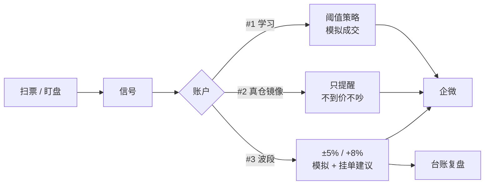
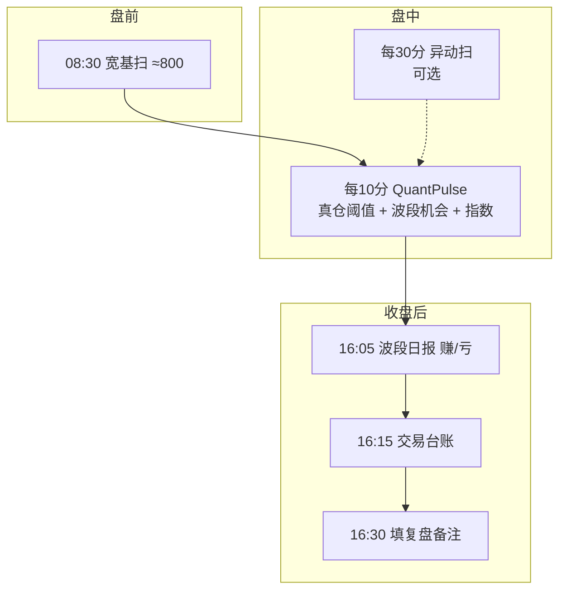
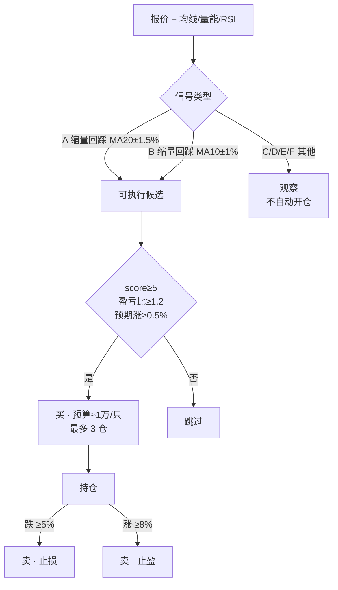
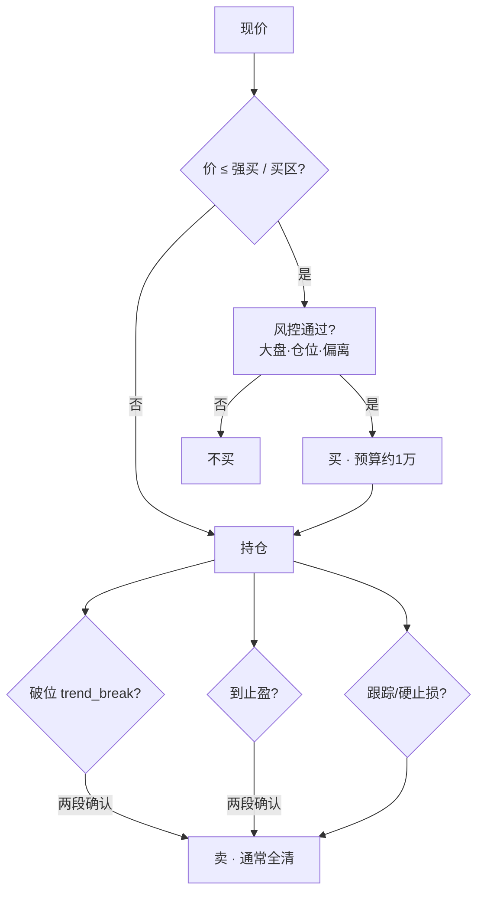
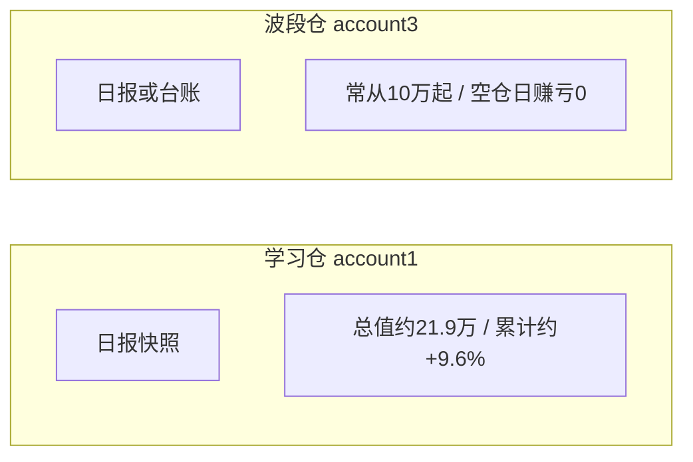

# quant-learn · A股量化学习仓

> **目标**：模拟验证 → 每天给你 **实盘挂单建议**（不默认自动实盘下单）  
> **跑起来**：发给 OpenClaw → [docs/DEPLOYMENT.md](docs/DEPLOYMENT.md)  
> **定时器**： [docs/CRON_JOBS.md](docs/CRON_JOBS.md) · **复盘**：[docs/REVIEW_LOOP.md](docs/REVIEW_LOOP.md)

---

## 一句话地图



| 账户 | 干什么 | 自动成交？ |
|:----:|--------|:----------:|
| **#1 learn** | 模拟学习仓（阈值） | 模拟 ✅ |
| **#3 swing_trade** | 波段模拟 → 挂单建议 | 模拟 ✅ |

> #2 真仓镜像可选，日常企微**默认不盯**。

---

## 一天怎么转



详情与 schtasks 模板 → [CRON_JOBS.md](docs/CRON_JOBS.md)

---

## 买什么 · 卖什么

### ① 波段策略（你每天主要看的）

池子：稳定蓝筹 ≈44 · 数据：腾讯行情 + 前复权日 K



| | 条件（白话） |
|--|-------------|
| **买** | 类型 **A/B** + 分 ≥5 + 过过滤；一手约 **1 万元**；仓位 **≤3** |
| **卖** | 成本 **-5%** 止损 / **+8%** 止盈 |
| **盘中** | Pulse 只 **提醒**；**收盘** `swing_daily_report` 才在 #3 模拟成交 |

信号速查：

| 型 | 含义 | 默认可成交？ |
|:--:|------|:------------:|
| A | 缩量回踩 MA20 | ✅ |
| B | 缩量回踩 MA10 | ✅ |
| C | 布林下轨 | ❌ 观察 |
| D | RSI&lt;35 | ❌ |
| E | 三连阴缩量企稳 | ❌ |
| F | 单日大跌缩量 | ❌ |

代码：`scripts/swing_auto.py` · `scripts/swing_daily_report.py`

---

### ② 学习仓阈值（#1）

阈值日更：买区≈MA10，强买≈MA20，破位/止盈用 MA+ATR 校准。



| | 条件（白话） |
|--|-------------|
| **买** | 价进 **buy_strong / buy_zone** + 风控过关 |
| **卖** | 破位 / 止盈：**盘中挂起 → 收盘武装 → 次日确认** 再卖（防假跌） |
| **仓** | 约 1 万/笔；总仓位有上限（config） |

代码：`vqlearn/strategies/threshold_strategy.py` · `scripts/sim_executor.py`

---

## 怎么回测


| 代际 | 入口 | 数据 | 用途 |
|------|------|------|------|
| **当前可信入口** | `scripts/run_dual_strategy_backtest.py` | 显式 `adjustment_type=raw` 的多股 CSV | #1 阈值 + #3 波段，共享现金、T+1、统一费用 |
| **Shadow 对照** | `scripts/compare_strategy_shadow.py` | 同上 | 比较现行参数与候选参数，不改生产 |
| **Paper 证据** | `scripts/weekly_strategy_evidence.py` | 只读 SQLite + optimize JSON | FIFO 归因、2×成本与晋级阻断原因 |
| 老 Backtrader | `backtest.py` | AKShare / BaoStock CSV | 均线·MACD·布林·复合 |
| vqlearn v2（legacy） | `vqlearn/runners/run_backtest_v2.py` | baostock | 同 bar close，结果只作历史参考 |
| 冒烟 | `vqlearn/runners/run_backtest.py` | 新浪→akshare | 短窗自检 |

当前入口默认：T 日信号最早 T+1 open 成交；所有股票共享现金；佣金、印花税和过户费统一走 `quant_core.fees.FeeModel`。

```bash
# 严格模式：CSV 必须显式声明 adjustment_type=raw
python scripts/run_dual_strategy_backtest.py data \
  --mode baseline --start 2024-07-01 --end 2026-05-20 \
  --output output/strategy_research/baseline.json

# 仓库旧 CSV 缺 raw 元数据时，只允许显式研究模式；报告会标记不得用于生产
python scripts/run_dual_strategy_backtest.py data \
  --mode optimize --start 2024-07-01 --end 2026-05-20 \
  --holdout 2026-02-01 --allow-adjusted-research \
  --output output/strategy_research/optimize.json

# 现行参数 vs 候选参数，只读 shadow
python scripts/compare_strategy_shadow.py data \
  --start 2025-01-01 --end 2026-05-20 \
  --optimize-json output/strategy_research/optimize.json \
  --allow-adjusted-research \
  --output output/strategy_research/shadow.json
```

---

## 回测数据长什么样

来源样例：`output/weekly_backtest_20260523.md`  
条件：本地 CSV 四票 · 初始 **10 万** · **复合策略** Top（柱状图用表代替，兼容预览）：

```text
002453 ████████████████████████████████████  +69.9%
000967 ██████████████████████████████        +59.9%
600330 ████████████████████████████          +56.7%
002256 ███████████████████████               +46.1%
```

| 标的 | 总收益 | 年化 | 夏普 | 胜率 |
|------|-------:|-----:|-----:|-----:|
| 002453 × 复合 | **+69.9%** | 31.8% | 1.58 | 42% |
| 000967 × 复合 | +59.9% | 27.8% | 7.89* | 50% |
| 600330 × 复合 | +56.7% | 26.4% | 0.81 | 67% |
| 002256 × 复合 | +46.1% | 21.9% | 1.04 | 50% |

> \* 极高夏普多来自**短样本 + 乐观撮合**，**不能**当实盘预期。  
> 阈值策略在基线上常 **0 成交** 或个别票大亏（参数窗没对齐）→ 看 `output/baseline_backtest.csv`。  
> 波段 A/B 已完成首轮共享现金 + T+1 + Walk-forward 研究；因旧 CSV 缺 raw 元数据且 OOS 未通过，**仍不可晋级生产参数**。

---

## 模拟效果（实盘旁路）



| 仓 | 近期快照 | 怎么看 |
|----|----------|--------|
| **#1** | ≈ **+9.6%**（`daily_reports/2026-07-12.md`） | 看持仓纪律与止损是否执行 |
| **#3** | 许多日 **0 成交 / 净值持平** | 看 `output/swing_daily/` 是否出「挂单建议」 |
| **台账** | `pm/trade_journal/今天.md` | **事实底稿**；备注给人填 |

本地仓库 DB 可能是空快照 ≠ 产机 Windows 上的数字。以产机 `sim_live_mirror.db` + 日报为准。

---

## 你每天看什么

| 优先级 | 看哪 | 得到什么 |
|:------:|------|----------|
| 1 | 企微 Pulse / 波段日报 | 到价提醒、今天赚亏、挂什么价 |
| 2 | **`output/strategy_review/今天.md`** | **策略哪里不对、今天该改什么** |
| 3 | `pm/trade_journal/` | 成交明细复盘 |
| 4 | `pm/cursor_queue/` | 晚上 Cursor **尽量多修**（不限 P0） |

```powershell
cd C:\Users\Administrator\.openclaw\workspace\quant-learn
.venv\Scripts\python.exe -u scripts\quant_pulse.py --force --no-push
.venv\Scripts\python.exe -u scripts\swing_daily_report.py --no-push
.venv\Scripts\python.exe -u scripts\trade_journal.py --no-push
.venv\Scripts\python.exe -u scripts\strategy_review.py --no-push --write-spec
```

---

## 文档导航

| 文档 | 一句话 |
|------|--------|
| **[METHODOLOGY.md](docs/METHODOLOGY.md)** | **每天复盘该改什么、不该改什么（先读这个）** |
| **[STRATEGY_SPEC.md](docs/STRATEGY_SPEC.md)** | **当前策略全部参数（自动生成，勿手改）** |
| [DEPLOYMENT.md](docs/DEPLOYMENT.md) | OpenClaw 怎么把系统跑起来 |
| [CRON_JOBS.md](docs/CRON_JOBS.md) | 定时器是否合理、必开清单 |
| [REALTIME.md](docs/REALTIME.md) | 盘中监控全景 |
| [REVIEW_LOOP.md](docs/REVIEW_LOOP.md) | 复盘 / 需求 / Cursor 队列 |
| [ROADMAP.md](docs/ROADMAP.md) | 需求与缺口（含波段回测研究版状态） |
| [STRATEGY_RESEARCH_2026-07-31.md](docs/STRATEGY_RESEARCH_2026-07-31.md) | #1/#3 首轮可信回测、OOS 与晋级结论 |

---

## 红线

- 默认 **不** 自动实盘下单（要 live 需你明文开）  
- webhook 放 `config.local.yaml`，**不进 git**  
- 交易扫描用 **bat / schtasks**，别让弱模型 agentTurn 半夜改仓控  
- 台账表格数字：**脚本写**，人工/LLM 只填「复盘备注」
