# 定时任务清单

> **权威跑法**：[DEPLOYMENT.md](./DEPLOYMENT.md) ★ 章节  
> **实时层**：[REALTIME.md](./REALTIME.md) · **复盘**：[REVIEW_LOOP.md](./REVIEW_LOOP.md)  
> 产机：`C:\Users\Administrator\.openclaw\workspace\quant-learn` · 时区 `Asia/Shanghai`  
> 更新：2026-07-15

---

## 一天长什么样（推荐态）

```mermaid
gantt
    title 交易日调度（Asia/Shanghai）
    dateFormat HH:mm
    axisFormat %H:%M
    section 盘前
    MorningScan 宽基≈800     :m1, 08:30, 40m
    section 盘中
    QuantPulse 每10分        :active, p1, 09:35, 315m
    IntradayScanner 每30分   :i1, 10:00, 270m
    section 收盘后
    SwingDaily 波段赚亏      :s1, 16:05, 10m
    TradeJournal 台账        :t1, 16:15, 10m
    OpenClaw 复盘/入库       :crit, r1, 16:30, 120m
    CursorQueue 完整菜单      :crit, q1, 18:15, 30m
```



| 时刻 | 任务 | bat | 为什么开 |
|:----:|------|-----|----------|
| **08:30** | 宽基选股 | `morning_scanner_runner.bat` → `scanner_with_fallback` | 早上找票 |
| **09:35→14:50 /10m** | 统一脉搏 | `quant_pulse_runner.bat` | **真仓阈值 + 波段机会 + 指数**（一条链路） |
| **10:00→14:30 /30m** | 全市场异动 | `intraday_scanner_runner.bat` | 发现新票（消息多，可选） |
| **16:05** | 波段日报 | `swing_daily_report_runner.bat` | #3 模拟成交 + 挂单建议 |
| **16:15** | 交易台账 | `trade_journal_runner.bat` | 复盘底稿 `pm/trade_journal/` |
| 15:10 或 16:20 | 双账户收盘摘要 | `daily_close_report_runner.bat` | #1+#3 概况（**已修日盈亏**） |
| **16:30** | 复盘备注 | OpenClaw 短会话 | 填台账备注；有问题就开 REQ/BUG |
| **17:00** | 需求全量入库 | OpenClaw | **发现问题一律写进 pm/**（不限条数） |
| **18:15** | Cursor 完整队列 | OpenClaw | `pm/cursor_queue/今天.md`（P0+P1+P2） |
| 18:30 | 企微队列摘要 | OpenClaw | 条数统计 + Cursor 一键话术 |

### 必开 vs 可选（别纠结）

| 级别 | 任务名 | 说明 |
|------|--------|------|
| **必开** | `QuantLearn_QuantPulse` | 盘中主心跳；已含真仓+波段盯盘 |
| **必开** | `QuantLearn_SwingDaily` | 收盘波段结论 |
| **必开** | `QuantLearn_TradeJournal` | 每日交易记录 |
| **建议开** | `QuantLearn_MorningScan` | 盘前宽基 |
| **消息多再关** | `QuantLearn_IntradayScanner` | 异动扫；吵就关 |
| **勿双开** | `SwingIntraday` / `PortfolioAlert` | 已被 Pulse 覆盖时请关，防重复推送 |

---

## A. 扫描层一句话

| 扫什么 | 有没有 | 谁推 |
|--------|:------:|------|
| 盘前宽基 ≈800 | ✅ | MorningScan |
| 盘中异动 ≈800 | ✅ | IntradayScanner（可选） |
| 波段蓝筹 ≈44 | ✅ | **QuantPulse 内嵌** |
| 你的持仓阈值 | ✅ | **QuantPulse 内嵌** |

---

## B. 建议停用（减噪）

| 现状 | 问题 | 处理 |
|------|------|------|
| 16:00 LLM「短线波段扫描」 | 与 16:05 SwingDaily 重复 | **停** |
| 单独 `PortfolioAlert` + `SwingIntraday` + Pulse 全开 | 同一事推三次 | **只留 Pulse** |
| 09/18/21 研发修码 LLM | 乱改代码 | **停**，改走 Cursor 队列 |
| ops / 理财师超长 LLM | 易超时 | 改 bat 或缩短提示 |

目标：**有效企微 ≤ 每天约 3～5 条**（不含盘中到价必达）。

---

## C. schtasks 模板（复制）

```bat
set ROOT=C:\Users\Administrator\.openclaw\workspace\quant-learn

schtasks /create /f /tn "QuantLearn_MorningScan"    /tr "%ROOT%\scripts\morning_scanner_runner.bat"    /sc weekly /d MON,TUE,WED,THU,FRI /st 08:30
schtasks /create /f /tn "QuantLearn_QuantPulse"     /tr "%ROOT%\scripts\quant_pulse_runner.bat"         /sc weekly /d MON,TUE,WED,THU,FRI /st 09:35
schtasks /create /f /tn "QuantLearn_IntradayScanner" /tr "%ROOT%\scripts\intraday_scanner_runner.bat"   /sc weekly /d MON,TUE,WED,THU,FRI /st 10:00
schtasks /create /f /tn "QuantLearn_SwingDaily"     /tr "%ROOT%\scripts\swing_daily_report_runner.bat"  /sc weekly /d MON,TUE,WED,THU,FRI /st 16:05
schtasks /create /f /tn "QuantLearn_TradeJournal"   /tr "%ROOT%\scripts\trade_journal_runner.bat"       /sc weekly /d MON,TUE,WED,THU,FRI /st 16:15

schtasks /query /fo LIST | findstr QuantLearn
```

**GUI 必须补两刀**（schtasks 创建后进「任务计划程序」）：

1. `QuantLearn_QuantPulse` → 重复间隔 **10 分钟**，持续到 **14:50**  
2. `QuantLearn_IntradayScanner` → 重复间隔 **30 分钟**，持续到 **14:30**

全量可选对照：

| 任务名 | bat | 建议 |
|--------|-----|------|
| QuantLearn_MorningScan | `morning_scanner_runner.bat` | 建议开 |
| QuantLearn_QuantPulse | `quant_pulse_runner.bat` | **必开** |
| QuantLearn_IntradayScanner | `intraday_scanner_runner.bat` | 建议开 / 吵则关 |
| QuantLearn_SwingDaily | `swing_daily_report_runner.bat` | **必开** |
| QuantLearn_TradeJournal | `trade_journal_runner.bat` | **必开** |
| QuantLearn_SwingIntraday | `swing_intraday_watch_runner.bat` | Pulse 已开则关 |
| QuantLearn_PortfolioAlert | `portfolio_alert_runner.bat` | Pulse 已开则关 |
| QuantLearn_StopLossWatch | `stop_loss_watch_runner.bat` | 学习仓用，可选 |
| QuantLearn_VqlearnLive | `vqlearn_live_runner.bat` | 按需（与 #3 双线会吵） |
| QuantLearn_DailyReview | `daily_review_runner.bat` | 可选（台账已覆盖大半） |
| QuantLearn_OpsDailyCheck | `ops_daily_check_runner.bat` | 可选 |
| QuantLearn_WeeklyReview | `weekly_review_runner.bat` | 周五可选 |

### 波段日报在干什么

```
swing_daily_report.py
  → 扫蓝筹池 → #3 模拟买卖（佣金+印花）
  → sim_daily_nav → output/swing_daily/今天.md
  → 企微短结论 + 实盘挂单建议
```

---

## D. OpenClaw Cron（对账用）

> 以产机 `openclaw cron list` 为准。交易类优先 **schtasks bat**，不要 agentTurn 扫盘/下单。

| 时间 | 历史名 | 建议 |
|:----:|--------|------|
| 16:00 | 短线波段扫描 LLM | **停** → SwingDaily |
| 16:30 | （新建）交易复盘备注 | agentTurn 短任务，见 REVIEW_LOOP §12 |
| 18:15 | （新建）PM 写 Cursor 队列 | agentTurn，见 REVIEW_LOOP §11 |
| 09/18/21 | 研发修码 | **停** |
| 19:00 | ops-agent LLM | 改 `ops_daily_check_runner.bat` |

systemEvent 示例（若不用 schtasks）：

```json
{
  "name": "交易台账",
  "schedule": { "kind": "cron", "expr": "15 16 * * 1-5", "tz": "Asia/Shanghai" },
  "sessionTarget": "isolated",
  "payload": {
    "kind": "systemEvent",
    "command": ".venv\\Scripts\\python.exe -u scripts\\trade_journal.py"
  },
  "delivery": { "mode": "announce", "channel": "wecom", "to": "jizhouhu" }
}
```

---

## E. 对账口令

```text
1. openclaw cron list
2. schtasks /query /fo LIST | findstr QuantLearn
3. 必有：QuantPulse / SwingDaily / TradeJournal；建议有 MorningScan
4. 无：与 SwingDaily 重复的 LLM 波段扫描；无 Pulse+PortfolioAlert+SwingIntraday 三重推送
5. 试跑 trade_journal.py --no-push → pm/trade_journal/今天.md 存在
6. 清单写入 pm/ops/今天-ops.md
```

---

## F. 账户与产出

| id | 名 | 用途 |
|----|----|------|
| **1** | learn | **模拟学习仓**（主推企微） |
| 2 | real_portfolio | 真仓镜像（可选，默认可不看） |
| **3** | swing_trade | **波段模拟**（挂单建议看这个） |

> 主人约定日常 **只盯 #1 + #3**。  
> 旧 bug：`daily_close_report` 曾把「当日盈亏」写成 `总资产-100000` → 出现 +119% 鬼畜数字（2026-07-15 已修）。

| 产出 | 路径 |
|------|------|
| 波段结论 | `output/swing_daily/YYYY-MM-DD.md` |
| 交易台账 | `pm/trade_journal/YYYY-MM-DD.md` |
| Pulse 日志 | `output/quant_pulse.log` |
| 成交 | DB `sim_trades` |
| 净值 | DB `sim_daily_nav` |
