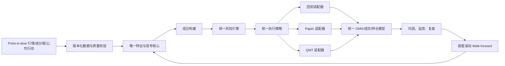
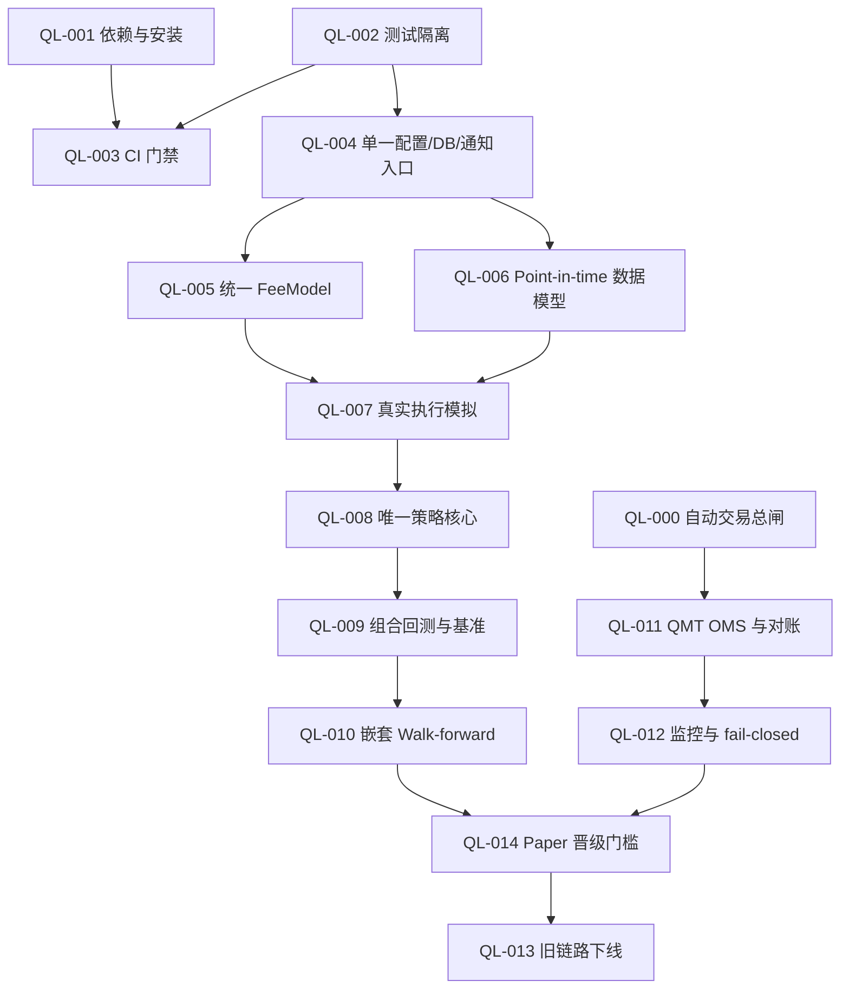

# quant-learn 可实施优化与多 Agent 任务拆分

> 文档状态：实施建议  
> 适用仓库：`quant-learn`  
> 评审日期：2026-07-13  
> 目标：把当前“多代代码并存的模拟交易/告警系统”收敛为可复现、可验证、回测与实盘一致的量化平台。

## 1. 总结

当前最重要的事情不是继续调 MACD、均线或绝对价格阈值，而是先消除会制造虚假收益的基础问题：

1. 回测、Paper、QMT 没有复用同一套策略与执行规则。
2. `vqlearn` 回测存在“看到当日收盘后仍按当日收盘成交”的乐观撮合。
3. 当前阈值、股票池和复权口径没有按历史时点重放。
4. 参数搜索继续使用所谓 OUT 数据选最优参数，最终测试集已经被污染。
5. 费率、滑点、数据库、配置、通知和去重逻辑存在多套实现。
6. 项目缺少依赖锁、CI，测试套件在收集阶段即失败。

在这些问题解决前，历史 leaderboard 只能作为探索结果，不能作为放大资金或承诺收益的依据。

### 实施原则

- 保持模拟盘，完成本文“生产晋级门槛”前不启用真实资金自动交易。
- 一次只让一个 Agent 负责一个任务包；每个任务包单独分支、单独提交。
- 先补测试再迁移，禁止大爆炸式重写。
- 旧链路先标记 deprecated，完成结果对齐后再删除。
- 策略信号、组合构建、风控和执行规则必须无网络、无数据库、无通知副作用。
- 数据或关键风控不可用时，自动交易应 fail closed；报告和人工建议可以降级。
- 不以胜率为唯一目标，核心目标是扣费后期望收益、回撤和破产概率。

## 2. 目标架构



建议新增的核心包：

```text
quant_core/
├── domain.py       # Bar、SignalIntent、OrderIntent、Fill、Position
├── fees.py         # 日期生效的佣金/印花税模型
├── execution.py    # 信号时点、成交时点、A 股成交约束
├── strategy.py     # 无 IO 的统一信号接口
├── portfolio.py    # 共享现金、权重、换手、风险预算
├── risk.py         # 组合与订单前风控
└── metrics.py      # 基准、超额收益、回撤、归因和统计置信度
```

SQLite 继续用于订单、成交、持仓、状态和审计；历史行情与特征建议改用版本化 Parquet/DuckDB。根目录 `config.yaml + config.local.yaml` 作为唯一配置来源。

## 3. Agent 协作协议

每个小型 Agent 必须遵守：

1. 分支命名：`agent/QL-XXX-short-name`。
2. 只修改任务包列出的文件；需要越界时先停下说明。
3. 不调整任何策略参数来“让测试收益更好”。
4. 不读取或提交 `config.local.yaml`、`.env`、真实凭据和运行数据库。
5. 新代码必须带单元测试；修复缺陷先写失败测试。
6. 提交说明需包含：
   - 修改目的；
   - 行为变化；
   - 测试命令与结果；
   - 兼容性或迁移风险。
7. 不直接删除旧路径；先加兼容适配与弃用告警。
8. 不启用真实账户，不降低 dry-run 安全级别。

通用 Agent 提示词：

```text
你负责 quant-learn 的任务 QL-XXX。

严格范围：
- 只修改任务卡列出的文件。
- 不调整策略参数，不连接外部交易账户，不提交密钥或数据库。
- 先添加/修复测试，再实现。
- 保留旧接口兼容；如不能兼容，停止并报告。

完成标准：
- 满足任务卡全部验收条件；
- 给出实际运行的测试命令和结果；
- 给出修改文件清单、风险与回滚方式；
- 不顺手做无关重构。
```

## 4. 实施波次与依赖



可并行安排：

- 第一波：QL-000、QL-001、QL-002。
- 第二波：QL-003、QL-004、QL-006 的设计与数据 fixture。
- 第三波：QL-005、QL-007、QL-011。
- 第四波：QL-008、QL-012。
- 第五波：QL-009、QL-010。
- 第六波：QL-014；稳定后再做 QL-013。

## 5. 任务卡

### QL-000：增加自动交易总闸和账户白名单

**优先级**：P0  
**可并行**：是  
**目的**：在架构整改期间保证任何误配置都不能意外发送真实订单。

**主要文件**

- `sim/config.py`
- `broker/factory.py`
- `gateways/qmt_gateway.py`
- 新增 `tests/test_live_trading_gate.py`

**修改点**

- 新增统一的 `LiveTradingGate`。
- 默认只允许 `sim`/`dry_run`。
- 真发送必须同时满足：
  - 配置明确启用；
  - 环境变量确认令牌匹配；
  - 账户位于 allowlist，而非仅“不在 denylist”；
  - 单笔金额、单日金额和当日亏损未越限。
- 启动日志打印最终模式，但不得打印凭据。

**验收条件**

- 缺任一确认条件时，QMT 订单被拒绝并留下结构化审计记录。
- 未知账户永远不能真下单。
- dry-run 和当前模拟链路行为不变。
- 覆盖配置缺失、令牌错误、账户不在白名单、金额超限四类测试。

**禁止范围**

- 不实现新的 QMT 回调。
- 不修改策略信号。

---

### QL-001：建立可复现的依赖和安装方式

**优先级**：P0  
**可并行**：是  
**目的**：让研究、测试和 Windows/QMT 环境均有明确依赖边界。

**主要文件**

- 新增 `pyproject.toml`
- 新增锁文件（优先 `uv.lock`）
- `README.md`
- `SETUP_GUIDE.md`

**修改点**

- 拆分 extras：`research`、`web`、`vnpy`、`dev`。
- 明确 QMT 环境为 Windows + Python 3.11；xtquant 作为本地/券商依赖，不伪造 PyPI 版本。
- Linux 默认支持研究和 sim，不声称支持 QMT。
- 提供从空环境开始的安装、测试、回测命令。

**验收条件**

- 干净环境可执行 `uv sync --extra research --extra dev`。
- `python -m pytest --collect-only tests` 不因缺少未声明的普通依赖失败。
- 文档中的命令与真实文件路径一致。

**禁止范围**

- 不修改业务代码。
- 不把 QMT 二进制或本地绝对路径提交进仓库。

---

### QL-002：修复测试收集与 import-time 副作用

**优先级**：P0  
**可并行**：是  
**目的**：使测试不依赖真实数据库、网络或脚本导入副作用。

**主要文件**

- `scripts/daily_review.py`
- `scripts/test_bug001_fix2.py`
- `tests/conftest.py`
- 新增或调整 `pytest.ini`
- 与收集错误直接相关的测试文件

**修改点**

- 所有脚本的查询、打印、`sys.exit()` 移入 `main()`。
- 测试通过 fixture 使用临时 SQLite，并调用正式 schema 初始化函数。
- pytest 默认只收集 `tests/test_*.py`，不收集 `scripts/test_*.py`。
- 将依赖 vnpy/QMT/网络的测试标记为 `integration` 或 `qmt`。

**验收条件**

- `python -m pytest --collect-only -q` 零错误。
- `python -m pytest tests -q` 不访问真实 `data/*.db`。
- import `scripts.daily_review` 不产生输出、不连接数据库。

**禁止范围**

- 不通过批量 skip 隐藏普通单元测试失败。
- 不删除现有测试。

---

### QL-003：增加 CI 门禁

**优先级**：P0  
**依赖**：QL-001、QL-002  
**目的**：禁止不可测试的修改进入主分支。

**主要文件**

- 新增 `.github/workflows/ci.yml`，或仓库实际平台对应的流水线文件
- 可选新增 `scripts/ci_checks.py`

**修改点**

- Python 3.11/3.12 跑 unit tests。
- 增加格式、静态检查和 `pytest --collect-only`。
- QMT 集成测试独立为手工或 Windows runner job。
- 禁止 CI 访问真实 webhook 和交易账户。

**验收条件**

- Linux CI 可稳定通过 research/sim 单元测试。
- QMT job 未配置 runner 时明确 skipped，而不是假成功。
- 测试报告可下载并显示用例数。

---

### QL-004：统一配置、数据库和通知入口

**优先级**：P0  
**依赖**：QL-002  
**目的**：结束多份配置、多个 DB 默认路径和多套 webhook 读取逻辑。

**主要文件**

- `sim/config.py`
- `sim/db.py`
- `notifier/wecom_notifier.py`
- `vqlearn/strategies/threshold_strategy.py`
- `scripts/portfolio_alert.py`
- `config.yaml`

**修改点**

- 根 `config.yaml` + `config.local.yaml` 为唯一配置。
- `QUANT_DB_PATH` 经一个函数解析；测试必须显式注入临时路径。
- `notifier/wecom_notifier.py` 成为唯一企微实现。
- 对以下旧源发弃用告警，不立即删除：
  - `config/config.yaml`
  - `vqlearn/config/portfolio.yaml`
  - 硬编码 `RULES`/`HOLDINGS`
  - 其他 webhook helper。
- 配置加载结果增加 schema 校验和 `config_hash`。

**验收条件**

- 相同进程内所有模块解析出同一 DB 路径。
- 配置字段缺失时报可定位错误，不静默使用危险默认值。
- 敏感字段仅从 local 配置或环境变量读取。
- 单元测试覆盖配置覆盖、非法 schema 和 DB 路径。

**禁止范围**

- 本任务不迁移历史数据。
- 不删除旧配置文件。

---

### QL-005：统一日期生效的 FeeModel

**优先级**：P0  
**依赖**：QL-004  
**目的**：保证回测、sim 和 QMT 审计使用同一费用口径。

**主要文件**

- 新增 `quant_core/fees.py`
- `sim/engine.py`
- `broker/sim_broker.py`
- `broker/qmt_broker.py`
- `backtest.py`
- `vqlearn/services/backtest_engine.py`
- 新增 `tests/test_fee_model.py`

**修改点**

- 一个 `FeeModel.calculate(side, amount, trade_date)` 返回佣金、印花税、其他费用。
- 支持最低佣金和按日期生效的税率。
- 回测和 sim 从同一配置构建 FeeModel。
- QMT 成交回调优先使用券商实际费用；不可得时才使用估算并标记 `estimated=true`。

**验收条件**

- 同一成交在各路径的费用结果完全一致。
- 买入不收印花税，卖出按交易日期使用正确税率。
- 最低佣金边界有测试。
- 删除业务路径中的重复硬编码；兼容常量只能保留弃用代理。

---

### QL-006：建立 Point-in-time 数据模型

**优先级**：P0  
**依赖**：QL-004  
**目的**：消除复权、股票池、停牌、ST、退市和阈值的事后偏差。

**主要文件**

- 新增 `quant_core/domain.py`
- 新增 `quant_core/data.py`
- `vqlearn/services/history_loader.py`
- `scripts/data_source_manager.py`
- 新增 `tests/fixtures/market_data/`
- 新增 `tests/test_point_in_time_data.py`

**修改点**

- Bar 至少包含：symbol、exchange、timestamp、OHLCV、raw/adjusted 标识、数据可见时间、source。
- 特征可使用调整后序列；执行必须使用未复权真实价格，两者由同一 adjustment factor 对齐。
- 保存每日股票池、ST、停牌、上市/退市状态快照。
- 阈值保存 `effective_from/effective_to/calculated_at/input_end_time`，禁止拿当前阈值回放过去。
- 数据产物写 manifest：来源、抓取时间、范围、行数、checksum。

**验收条件**

- 测试证明 T 日决策读取不到 T 日收盘后才发布的数据。
- 除权日调整后特征连续，但订单价格仍为真实可交易价格。
- 历史股票池包含后来退市/移出的标的。
- 陈旧或缺失数据被明确标记，不以最新可用行冒充目标日期。

**禁止范围**

- 不在本任务实现完整回测。
- 不直接下载全市场历史数据进 Git。

---

### QL-007：实现可信的执行模拟和 A 股约束

**优先级**：P0  
**依赖**：QL-005、QL-006  
**目的**：修复同 bar 收盘成交，并统一回测/Paper 的成交规则。

**主要文件**

- 新增 `quant_core/execution.py`
- `vqlearn/services/backtest_engine.py`
- 新增 `tests/test_execution_policy.py`

**修改点**

- 默认模式：T 日收盘信号，最早 T+1 开盘成交。
- 允许显式配置 `next_open`、`next_vwap` 等模式，禁止隐式同 bar close。
- 模拟：
  - A 股 T+1 可卖数量；
  - 100 股买入单位与零股卖出；
  - 停牌；
  - 涨跌停不可成交；
  - 成交量参与率；
  - 买卖方向滑点；
  - 部分成交和拒单。
- 每笔 Fill 记录 signal_time、submit_time、fill_time、price_source。

**验收条件**

- golden test 证明 T 日信号绝不在 T 日成交。
- 涨停买不到、跌停卖不出、当日买入次日才可卖。
- 费用由 QL-005 注入。
- 所有原 leaderboard 标记为 legacy，不覆盖旧文件；新结果写新版本目录。

---

### QL-008：收敛为唯一策略核心

**优先级**：P0  
**依赖**：QL-007  
**目的**：同一输入在回测、Paper、QMT 生成相同 SignalIntent。

**主要文件**

- 新增 `quant_core/strategy.py`
- `vqlearn/strategies/pure_signals.py`
- `vqlearn/strategies/threshold_strategy.py`
- `strategies/threshold_alert_strategy.py`
- 新增 `tests/test_strategy_parity.py`

**修改点**

- 定义无 IO 接口：

```python
decide(features, portfolio_state, strategy_config, as_of) -> list[SignalIntent]
```

- `SignalIntent` 只描述方向、目标、置信度、理由和生效时间，不直接下单。
- vnpy 策略变为薄适配器：转换输入、调用核心、转发意图。
- 通知、SQLite、网络、交易时段和执行状态机移到外围服务。
- 先迁移 threshold 策略；其他策略逐个迁移。

**验收条件**

- 固定 fixture 下，研究、Paper、vnpy 三个适配器输出完全一致。
- 导入和调用策略核心不会访问文件、网络或数据库。
- 原策略入口仍能运行并发弃用告警。

**禁止范围**

- 不同时迁移所有老策略。
- 不改变 threshold 规则含义来改善收益。

---

### QL-009：组合级回测、真实基准与统一指标

**优先级**：P1  
**依赖**：QL-008  
**目的**：替代“每只股票独立资金再平均”的不可投资 leaderboard。

**主要文件**

- 新增 `quant_core/portfolio.py`
- 新增 `quant_core/metrics.py`
- 新增 `research/run_portfolio_backtest.py`
- `web/app.py`
- 新增 `tests/test_portfolio_backtest.py`

**修改点**

- 全股票共享现金、持仓和风险额度。
- 支持权重、调仓频率、现金占比、最大持仓、行业约束和换手约束。
- 引入可交易基准：沪深300、中证500或策略对应指数。
- 输出：
  - CAGR、波动、Sharpe、Sortino、Calmar、最大回撤；
  - 超额收益、Information Ratio、beta；
  - 换手、成本、容量、拒单率；
  - 单股/行业/PnL 来源归因；
  - 交易数和置信区间。
- Web 不再用全 0 benchmark。

**验收条件**

- 每日满足：现金 + 持仓市值 = 总资产（允许精度误差）。
- 基准序列真实且与策略日期对齐。
- 单股收益不能被重复分配独立本金。
- 指标对一组手算 fixture 结果一致。

---

### QL-010：替换为嵌套滚动 Walk-forward

**优先级**：P1  
**依赖**：QL-009  
**目的**：保持真正未污染的样本外结果，并控制多重试验。

**主要文件**

- 新增 `research/walk_forward.py`
- 新增 `research/experiment_registry.py`
- `scripts/weekend_full_2026-05-24.py` 仅增加 legacy 标识，不继续扩展
- `scripts/composite_gridsearch_2026-05-24.py` 仅增加 legacy 标识
- 新增 `tests/test_walk_forward_split.py`

**修改点**

- 内层训练窗口选参数，外层滚动窗口只评估。
- 最终 holdout 在所有策略、参数和特征冻结后只运行一次。
- 支持 purge/embargo，防止标签重叠泄漏。
- 每次实验记录 data_hash、config_hash、code_version、参数数目和尝试次数。
- 报告 Deflated Sharpe、bootstrap 区间、PBO 或 FDR/多重检验修正。
- 禁止按 OUT 排序后再称为 OOS。

**验收条件**

- 测试证明任何 OUT/holdout 日期不能进入参数选择函数。
- 相同 hash 和 seed 可复现相同结果。
- 报告同时展示全部窗口，不能只展示 Top N。
- 旧 70/30 与 243 组报告显式标记“探索性、不可部署”。

---

### QL-011：补全 QMT OMS、回调和对账

**优先级**：P0  
**依赖**：QL-000  
**目的**：让订单状态、成交、持仓和本地账本可恢复、可核对。

**主要文件**

- `gateways/qmt_gateway.py`
- `broker/qmt_broker.py`
- `apps/intraday_app.py`
- `apps/order_replay.py`
- 新增 `tests/test_qmt_order_state_machine.py`

**修改点**

- 明确并实现状态：created → submitted → accepted → partial → filled/cancelled/rejected。
- 注册并处理订单、成交、撤单、断线回调。
- broker request id、QMT order id、trade id 分开保存。
- 启动、重连和收盘后执行 broker 对账；差异触发 kill switch。
- 幂等处理重复和乱序回调。
- 策略仓位不得只依赖进程内 `self.pos`，应由 OMS/账户快照恢复。

**验收条件**

- 重复成交回调不会重复记账。
- 部分成交后撤单的数量、现金和持仓正确。
- 进程重启能从订单和账户快照恢复。
- 断线或对账不一致时禁止新开仓，但允许受控撤单/风险减仓。

**禁止范围**

- 测试必须使用 fake gateway，不连接真实 QMT。

---

### QL-012：统一监控并对关键数据 fail closed

**优先级**：P1  
**依赖**：QL-008、QL-011  
**目的**：避免行情、风控或通知故障被静默吞掉。

**主要文件**

- `sim/monitoring.py`
- `vqlearn/services/buy_risk_guard.py`
- `scripts/data_freshness_monitor.py`
- `notifier/wecom_notifier.py`
- 新增 `tests/test_trading_health_gate.py`

**修改点**

- 建立 `TradingHealthGate`：
  - 行情时间戳；
  - 交易日历；
  - 数据源状态；
  - OMS 对账状态；
  - DB 可写；
  - 风控快照可用。
- 对新开仓 fail closed；平仓按独立降级策略处理。
- 告警发送失败不阻断风控，但必须进入本地 durable queue。
- 日志统一为结构化事件并包含 correlation id。

**验收条件**

- 陈旧行情、风控不可用、OMS 未对账时不能开新仓。
- 通知失败后可重试且不会重复发送。
- 健康状态可被 Web/日报读取。

---

### QL-013：下线重复与遗留链路

**优先级**：P2  
**依赖**：QL-014 稳定运行后  
**目的**：减少误用、重复下单和维护分叉。

**候选范围**

- `sim_executor.py` / `sim_executor_v2.py`
- `run_daily.py` / `run_daily_improved.py`
- 多套 webhook helper
- `config/config.yaml`
- `vqlearn/config/portfolio.yaml`
- 根目录硬编码 `RULES`/`HOLDINGS`
- 一次性 `_patch_*`、`*_fixed.py`、`*_temp.py`

**修改点**

- 先生成调用关系和外部调度清单。
- 旧入口至少经历一个版本的弃用告警。
- 将仍需保留的脚本移到 `legacy/`，并从默认 pytest/调度中排除。
- 删除前确认 Windows Task Scheduler、cron、文档和外部 Agent 不再调用。

**验收条件**

- 每个生产职能只有一个入口。
- 默认路径只有一个配置、一个 DB resolver、一个通知器和一个执行器。
- 删除清单有回滚提交和迁移文档。

---

### QL-014：建立 Paper → 小额 → 放量晋级门槛

**优先级**：P1  
**依赖**：QL-010、QL-012  
**目的**：用可观测的真实执行偏差决定是否放量，而不是凭一次回测。

**主要文件**

- 新增 `research/promotion_gate.py`
- 新增 `docs/STRATEGY_PROMOTION_POLICY.md`
- `vqlearn/services/signal_review.py`
- Web/日报相关指标接口

**建议门槛（可配置，不是收益保证）**

- 数据：
  - 所有决策均有 data_hash/config_hash；
  - 无未来数据违规；
  - 关键行情陈旧率为 0。
- 研究：
  - 覆盖至少三个不同市场状态；
  - 建议至少 100 笔相对独立的已平仓交易，不足则标记证据不足；
  - OOS 超额收益在多数滚动窗口为正；
  - 2 倍成本压力下净期望仍为正；
  - 收益不由单一股票或单一月份主导。
- Paper：
  - 建议至少运行 60 个交易日；
  - 回测/Paper 信号一致率、成交偏差、拒单率在阈值内；
  - 最大回撤没有突破预设风险预算；
  - OMS 每日对账无未解释差异。
- 放量：
  - 先极小资金；
  - 按风险额度分级增加，不按近期盈利倍增；
  - 任一风险门槛失败自动降级到 Paper。

**验收条件**

- 晋级结果由机器可读规则生成，不允许手工跳过 P0 门槛。
- 每次晋级保存证据快照。
- 支持自动降级和 kill switch。

## 6. 策略层优化实验

以下实验必须在 QL-010 完成后实施。每个实验只验证一个独立假设，禁止同时改股票池、参数、仓位和执行模型。

### EXP-01：用动态、时点化股票池替代当前持仓/推荐池

**假设**：系统化流动性和可交易性筛选能降低选择偏差与成交风险。

**建议规则**

- 每月或每周从当时可见的全市场重建股票池。
- 排除 ST/退市整理、上市时间过短、长期停牌、成交额不足标的。
- 保存每日/每期成分股快照。

**评估**

- 与固定池在同一策略、同一成本下对比。
- 报告换手、容量、退市样本和行业暴露。

### EXP-02：绝对价格阈值改为波动率归一化阈值

**假设**：ATR、历史分位或标准化偏离比固定价格更能跨股票、跨时期泛化。

**候选形式**

- `(price - MA20) / ATR20`
- 20/60 日收益分位数
- Bollinger z-score

**要求**

- 阈值只在训练窗口选择。
- 不允许为每只股票单独在 OUT 上挑最优参数。
- 与现有绝对阈值做消融实验。

### EXP-03：市场状态只控制风险敞口，不直接制造复杂信号

**假设**：在市场宽度恶化或指数趋势向下时降低总仓位，可改善尾部风险。

**候选方式**

- 指数位于 MA20/MA60 下方时降低目标仓位。
- 市场宽度、波动率或跌停扩散触发风险倍率。
- 数据不可用时禁止新开仓。

**评估**

- 重点比较 Calmar、最大回撤和左尾损失，而非只看胜率。

### EXP-04：风险预算仓位替代固定 100 股/固定金额

**假设**：按波动率和止损距离分配风险，能减少高波动股票对组合的支配。

**候选公式**

```text
position_value = min(
  portfolio_value * max_position_pct,
  risk_budget_per_trade / expected_loss_pct
)
```

**约束**

- 单股、行业、风格和组合总风险上限。
- 低流动性标的再受成交量参与率限制。

### EXP-05：只组合增量有效且低相关的 Alpha

MACD、SMA、KDJ、布林带多数来自同一价格序列，简单投票不等于分散。

**候选 Alpha 家族**

- 中期趋势；
- 短期反转；
- 质量/估值；
- 盈利或公告事件；
- 流动性与波动率。

**晋级要求**

- 单因子先独立通过 OOS。
- 报告 Rank IC、ICIR、收益相关性与边际贡献。
- 新信号加入组合后必须改善净收益/回撤，而不是只提高命中率。

## 7. 统一验收指标

所有研究报告至少包含：

1. 数据区间、股票池生成规则、数据版本和配置 hash。
2. 信号时间、订单时间、成交时间与价格来源。
3. 总收益、CAGR、最大回撤、Sharpe、Sortino、Calmar。
4. 对应基准、超额收益、Information Ratio 和 beta。
5. 交易次数、胜率、平均盈亏、profit factor、期望值。
6. 换手、佣金、印花税、滑点、市场冲击和拒单。
7. 单股、行业、月份和市场状态的 PnL 归因。
8. 参数尝试总次数和多重检验调整。
9. 滚动窗口全量结果及置信区间。
10. 1 倍、1.5 倍、2 倍交易成本压力测试。

建议采用的核心目标：

```text
Net Expectancy
= P(win) × AvgWin
  - P(loss) × AvgLoss
  - Fees
  - Slippage
  - MarketImpact
```

高胜率但平均亏损远大于平均盈利的策略仍应淘汰。

## 8. 明确禁止事项

- 禁止依据当前 `F_composite_gridsearch.md` 的 OUT 最优参数直接上线。
- 禁止拿当前 `portfolio.yaml/config.yaml` 阈值回测过去并称为时点化结果。
- 禁止把每只股票独立本金的平均收益称为可投资组合收益。
- 禁止为了通过测试降低交易成本、滑点或放宽成交规则。
- 禁止关键风控数据失败时默认放行新开仓。
- 禁止仅凭 2–6 笔交易、单一股票或单一行情阶段放大资金。
- 禁止在最终 holdout 上反复运行并继续调参。

## 9. 建议的首批 Agent 分配

建议先启动三个互不冲突的小型 Agent：

1. **Agent A：QL-000 自动交易总闸**
   - 快速降低误下单风险。
2. **Agent B：QL-001 依赖与安装**
   - 建立后续 Agent 的统一环境。
3. **Agent C：QL-002 测试隔离**
   - 让后续所有修改有可信测试门禁。

这三个任务完成并合并后，再启动 QL-003、QL-004 和 QL-006。不要先启动参数优化类 Agent。

